# Streaming data enrichment pipeline on Azure

This tutorial with walk you through how to build a streaming data enrichment pipeline on Azure. Please refer to [this blog post](https://dev.to/abhirockzz/tutorial-build-a-pipeline-to-join-streams-of-real-time-data-2bm2) for additional background.

**Components**

- [Azure Event Hubs](https://docs.microsoft.com/azure/event-hubs/event-hubs-about?WT.mc_id=devto-blog-abhishgu) (Input Data source) - ingests raw orders data
- [Azure SQL Database](https://docs.microsoft.com/azure/azure-sql/database/sql-database-paas-overview?WT.mc_id=devto-blog-abhishgu) (Reference Data source) - stores reference customer data
- [Azure Stream Analytics](https://docs.microsoft.com/azure/stream-analytics/stream-analytics-introduction?WT.mc_id=devto-blog-abhishgu) (Stream Processing) - joins the stream of orders data from Azure Event Hubs with the static reference customers data
- [Azure Cosmos DB](https://docs.microsoft.com/azure/cosmos-db/introduction?WT.mc_id=devto-blog-abhishgu) (Output data source) - acts as a "sink" to store enriched orders info

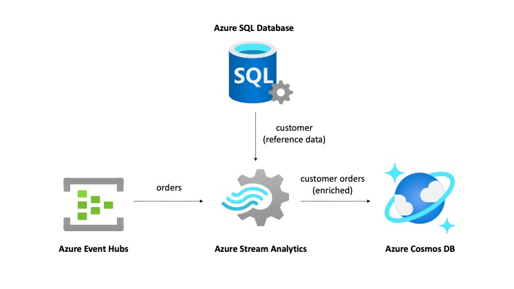

## Pre-requisites

- [Microsoft Azure account](https://docs.microsoft.com/azure/?WT.mc_id=devto-blog-abhishgu) - go ahead and [sign up for a free one!](https://azure.microsoft.com/free/?WT.mc_id=devto-blog-abhishgu)
- [Docker](https://docs.docker.com/get-docker/) - this will be used to run orders generator application
- Clone the project


```bash
git clone https://github.com/abhirockzz/streaming-data-pipeline-azure.git
cd streaming-data-pipeline-azure
```

## Setup and configuration

This section will cover the following:

- Setup Azure Event Hubs Namespace and Topic (`orders`)
- Setup Azure SQL DB and load customer data
- Create Azure Cosmos account and container
- Create and configure Azure Stream Analytics Job, Input source, Reference data and Output source

Before we setup the services, create a Resource Group - you can use the [Azure Portal](https://docs.microsoft.com/azure/azure-resource-manager/management/manage-resource-groups-portal?WT.mc_id=devto-blog-abhishgu#create-resource-groups) or Azure CLI ([az group create](https://docs.microsoft.com/cli/azure/group?view=azure-cli-latest&WT.mc_id=devto-blog-abhishgu#az-group-create) command)

```azurecli
az group create -l <location> -n <name of resource group>
```

> Create the rest of the services in the same resource group and location

### Azure Event Hubs

Create an [Event Hubs Namespace](https://docs.microsoft.com/azure/event-hubs/event-hubs-features?WT.mc_id=devto-blog-abhishgu#namespace) and Hub (topic) - the topic that you create (you can name it `orders`) will be used by Azure Stream Analytics as a (streaming) "source" for raw orders data. This is JSON data in this format:

```json
{
    "orderID": "a82bddcb-a709-4702-4fc0-e1b9445b87d2",
    "customerID": 42,
    "amount": 200
}
```

You can setup Event Hubs using either of these options: [Azure Portal](https://docs.microsoft.com/azure/event-hubs/event-hubs-create?WT.mc_id=devto-blog-abhishgu), [Azure CLI](https://docs.microsoft.com/azure/event-hubs/event-hubs-quickstart-cli?WT.mc_id=devto-blog-abhishgu), [ARM template](https://docs.microsoft.com/azure/event-hubs/event-hubs-resource-manager-namespace-event-hub?WT.mc_id=devto-blog-abhishgu) or [Azure PowerShell](https://docs.microsoft.com/azure/event-hubs/event-hubs-quickstart-powershell?WT.mc_id=devto-blog-abhishgu)

### Azure SQL Database

SQL Server is used as the reference data store. It contains customer information, for example:

```bash
  cust_id         cust_name                        city                
----------- ------------------------------ --------------------
    1           Willis Collins                    Dallas              
    2           Casey Brady                       Chicago             
    3           Walker Wong                       SanJose             
    4           Randall Weeks                     SanDiego            
    5           Gerardo Dorsey                    Dallas              
```

You can [follow these steps](https://docs.microsoft.com/azure/azure-sql/database/single-database-create-quickstart?tabs=azure-portal&WT.mc_id=devto-blog-abhishgu#create-a-single-database) to create a logical SQL server and a single database - use `customers` as the database name

Once completed, you should have a SQL server...

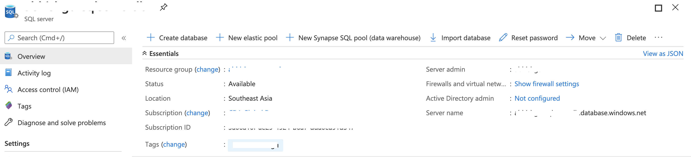

... and the `customers` database

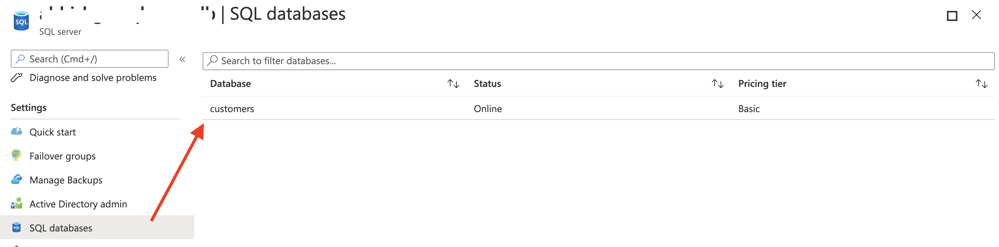

Go ahead, create a table in the database and import sample data (10000 rows from [`customers.csv`](https://github.com/abhirockzz/streaming-data-pipeline-azure/blob/master/customers.csv)). I have used [`sqlcmd` and `bcp`](https://docs.microsoft.com/azure/azure-sql/load-from-csv-with-bcp?WT.mc_id=devto-blog-abhishgu) (CLI tools for SQL Server) in the example below:

> If you want to use the Azure Portal to upload data, (skip this and) check the next step

To create a table:

```bash
sqlcmd -S <sql server name>.database.windows.net -U <admin username> -P <admin password> -d <database name> -i ./customers.sql
```

To import data:

```shell
bcp Crm.Customers in customers.csv -S <sql server name>.database.windows.net -d <database name> -U <admin username> -P <admin password> -q -c -t ,
```

To confirm that the data has been imported:

```shell
sqlcmd -S <sql server name>.database.windows.net -U <admin username -P <admin password> -d <database name> -Q "SELECT TOP 10 * FROM Crm.Customers;"
```

You can also use the [Query editor in the portal](https://docs.microsoft.com/azure/azure-sql/database/single-database-create-quickstart?tabs=azure-portal&WT.mc_id=devto-blog-abhishgu#query-the-database). Simply paste the contents of [`customers.sql`](https://github.com/abhirockzz/streaming-data-pipeline-azure/blob/master/customers.sql)) file into the editor and click **Run**

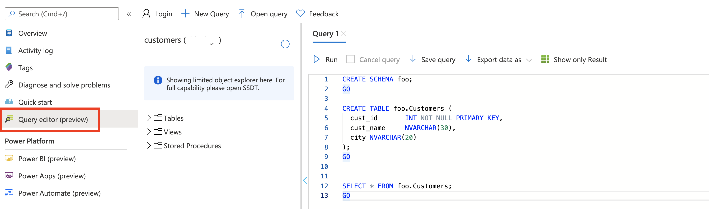

### Azure Cosmos DB

We will use Azure Cosmos DB to store the "enriched" data has customer information along with the raw orders data. For example, an item in the Cosmos DB container will look like this:

```json
{
    "order_id": "21a50dd1-6d40-4aa8-8ad9-a2fdcfb5f5e0",
    "customer_id": "8512",
    "purchase_amount": 182,
    "customer_name": "Robby Johns",
    "city": "NewJersey",
    "id": "044593cf-9399-42e5-b94c-6170bb9a3c1e",
    "_rid": "9P02AJ44T1ICAAAAAAAAAA==",
    "_self": "dbs/9P02AA==/colls/9P02AJ44T1I=/docs/9P02AJ44T1ICAAAAAAAAAA==/",
    "_etag": "\"04001fb0-0000-1800-0000-5f3d63630000\"",
    "_attachments": "attachments/",
    "_ts": 1597858659
}
```

You can use the Azure Portal to [create an Azure Cosmos DB account](https://docs.microsoft.com/azure/cosmos-db/create-cosmosdb-resources-portal?WT.mc_id=devto-blog-abhishgu#create-an-azure-cosmos-db-account). Once that's complete, go ahead and [add a database and container](https://docs.microsoft.com/azure/cosmos-db/create-cosmosdb-resources-portal?WT.mc_id=devto-blog-abhishgu#add-a-database-and-a-container)

> use `/customer_id` as the partition key for your container

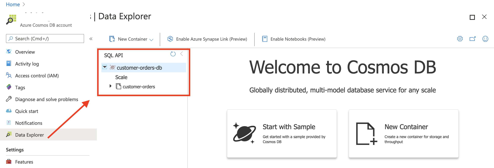

### Azure Stream Analytics

Finally, it's time to setup Azure Stream Analytics. It will stitch together all the components to create and end to end solution.

Start by creating an Azure Stream Analytics job. If you want to use the Azure Portal, just follow the [steps outlined in this section](https://docs.microsoft.com/azure/stream-analytics/stream-analytics-quick-create-portal?WT.mc_id=devto-blog-abhishgu#create-a-stream-analytics-job) or use the [Azure CLI instead](https://docs.microsoft.com/azure/stream-analytics/quick-create-azure-cli?WT.mc_id=devto-blog-abhishgu#create-a-stream-analytics-job) if you don't prefer clicking on a UI.

**Create Azure Event Hubs Input**

To configure the [Azure Event Hubs as a Streaming Input source](https://docs.microsoft.com/azure/stream-analytics/stream-analytics-define-inputs?WT.mc_id=devto-blog-abhishgu#stream-data-from-event-hubs), open the Job in the portal, choose **Input**

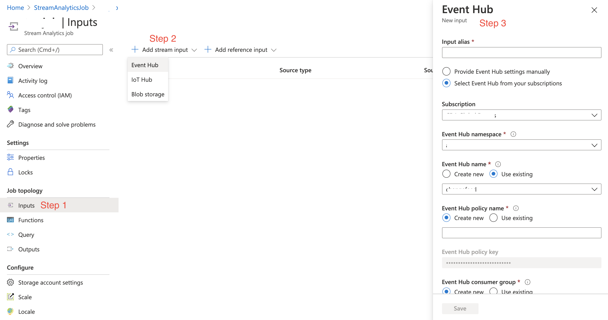

**Create Azure SQL Reference Input**

[To configure the Azure SQL Database as a Reference Input source](https://docs.microsoft.com/azure/stream-analytics/stream-analytics-use-reference-data?WT.mc_id=devto-blog-abhishgu#configure-sql-database-reference), open the Job in the portal, choose **Input** > **Add reference Input** > **SQL Database**

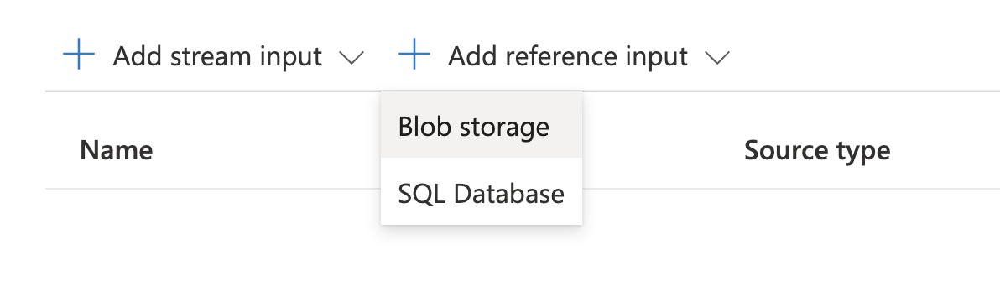

Choose the SQL database you created previously:

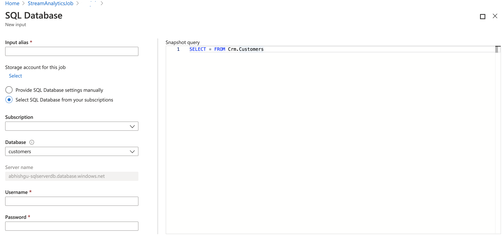

**Create Azure Cosmos DB Output**

[To configure Azure Cosmos DB as an Output](https://docs.microsoft.com/azure/stream-analytics/stream-analytics-documentdb-output?WT.mc_id=devto-blog-abhishgu), choose **Output** and proceed as below:

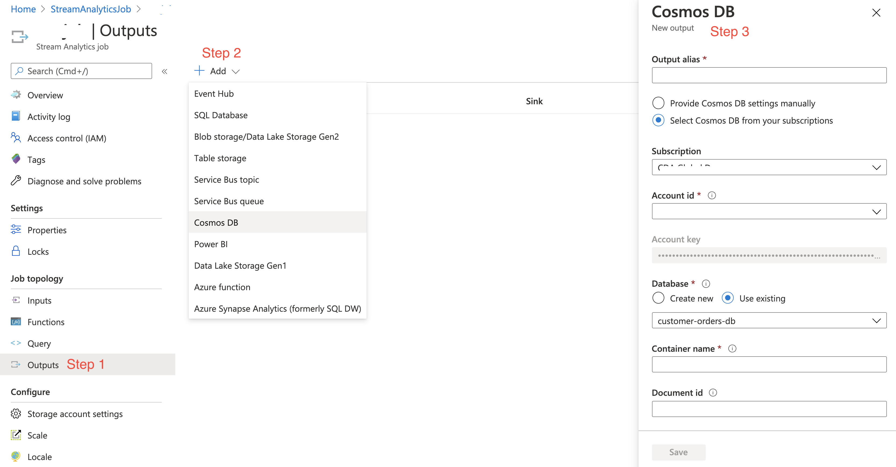

**Create Query**

Finally, we will need to setup the query that will leverage info from Input sources (Event Hubs and SQL Server) and pipe them to the Output (Cosmos DB). Open the Job, choose **Query** and enter the below query:

```shell
SELECT o.orderID as order_id, o.customerID as customer_id, c.cust_name as customer_name, c.city as city, o.amount as purchase_amount
FROM orders o
JOIN customers c  
ON o.customerID = c.cust_id
```

Here is the screenshot:


Once everything is setup, this is what your Job config should look like:

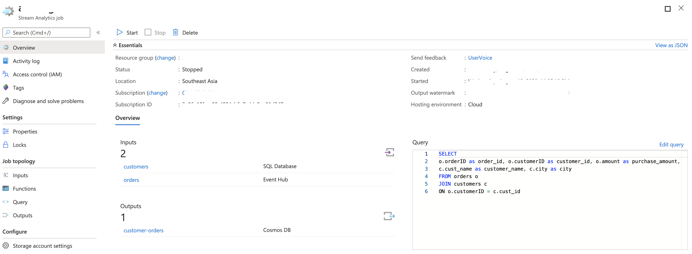 

## Run the streaming pipeline

> (Optional) Test with sample data - You can test you query with sample orders data. Upload the `sample-orders.json` file in the `order` Input and run the query to check the output.

Start the `Job` and wait for it to transition to **Running** status

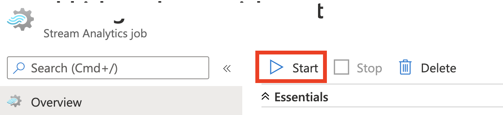

Export Event Hubs info as environment variables:

```bash
export EVENTHUBS_BROKER=<enter event hubs namespace>.servicebus.windows.net:9093
export EVENTHUBS_CONNECTION_STRING="Endpoint=sb://<enter event hubs namespace>.servicebus.windows.net/;SharedAccessKeyName=RootManageSharedAccessKey;SharedAccessKey=<enter event hubs key>"
export EVENTHUBS_TOPIC=orders
```

Start order generator application - this will push randomly generated orders to the Event Hubs topic:

```bash
docker run -it -e EVENTHUBS_BROKER=$EVENTHUBS_BROKER -e EVENTHUBS_CONNECTION_STRING=$EVENTHUBS_CONNECTION_STRING -e EVENTHUBS_TOPIC=$EVENTHUBS_TOPIC abhirockzz/orders-generator
```

Wait for a few orders to be sent. You should see logs as such:

```bash
sent message to partition 1 offset 39
{"orderID":"6937ffdb-6db3-9164-a480-599493da9329","customerID":8512,"amount":182}
sent message to partition 3 offset 48
{"orderID":"7e4b8eec-429d-d800-b1e8-3ecc7efb4041","customerID":5027,"amount":33}
sent message to partition 2 offset 43
{"orderID":"7676330c-76b7-641c-f73c-12384789fa94","customerID":2200,"amount":60}
sent message to partition 4 offset 48
{"orderID":"2e091408-e960-57aa-c1c2-d432bab91e4b","customerID":7203,"amount":403}
sent message to partition 1 offset 40
{"orderID":"590a3827-e353-5f07-4cb5-44518dc2cad1","customerID":954,"amount":117}
sent message to partition 1 offset 41
{"orderID":"5cea8317-48c3-0235-b177-8a54a5ac5c5b","customerID":6504,"amount":332}
sent message to partition 4 offset 49
{"orderID":"e2d8e7ee-cf97-3992-9074-1b363b608b27","customerID":3633,"amount":158}
```

The Stream Analytics query should now kick into action and `JOIN` the orders information (from Event Hubs) with the customer reference data (in SQL Server). To confirm this, check the enriched orders information in Cosmos DB.

Go to your Cosmos DB account in the Azure portal, choose **Data Explorer** and see the **Items** in your container


Run a few queries:

```shell
//orders from Chicago
SELECT * FROM c where c.city="Chicago"

//average purchase amount for orders from Chicago
SELECT VALUE AVG(c.purchase_amount) from c where c.city="Chicago"

//average purchase amount per city
SELECT AVG(c.purchase_amount) AS avg_purchase, c.city
FROM c
GROUP BY c.city

//total purchase amount per city
SELECT SUM(c.purchase_amount) AS total_purchase, c.city
FROM c
GROUP BY c.city
```

Here is a screenshot:

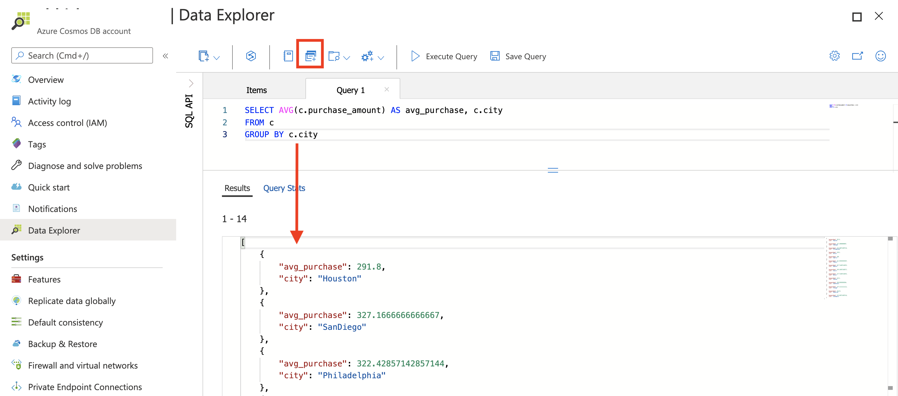

### Clean up

Once you're done, you can delete all the services by simply deleting the resource group ([az group delete](https://docs.microsoft.com/cli/azure/group?view=azure-cli-latest&WT.mc_id=devto-blog-abhishgu#az-group-delete))

```azurecli
az group delete -n <name of resource group>
```

## Wrap-up

I hope this helps you get started with Azure Stream Analytics and test the waters before moving on to more involved use cases. In addition to this, there is plenty of material for you to dig in!

- [Explore Architecture patterns](https://docs.microsoft.com/azure/stream-analytics/stream-analytics-solution-patterns?WT.mc_id=devto-blog-abhishgu)
- Reference solutions such as [Twitter sentiment analysis](https://docs.microsoft.com/azure/stream-analytics/stream-analytics-twitter-sentiment-analysis-trends?WT.mc_id=devto-blog-abhishgu), fraud detection, IoT data processing etc.
- [Common query patterns in Azure Stream Analytics](https://docs.microsoft.com/azure/stream-analytics/stream-analytics-stream-analytics-query-patterns?WT.mc_id=devto-blog-abhishgu)